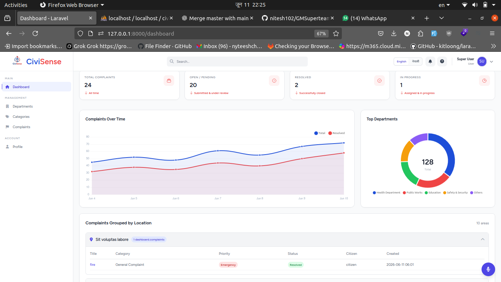
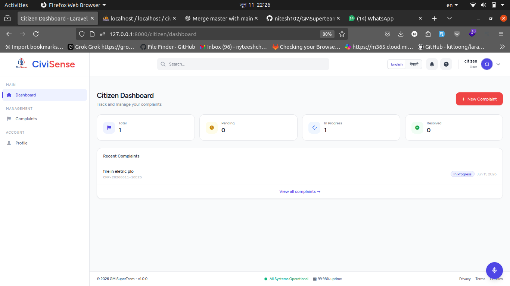
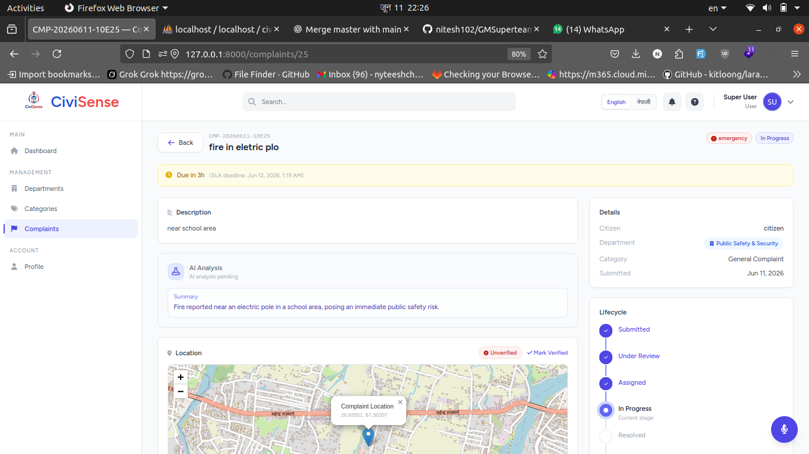
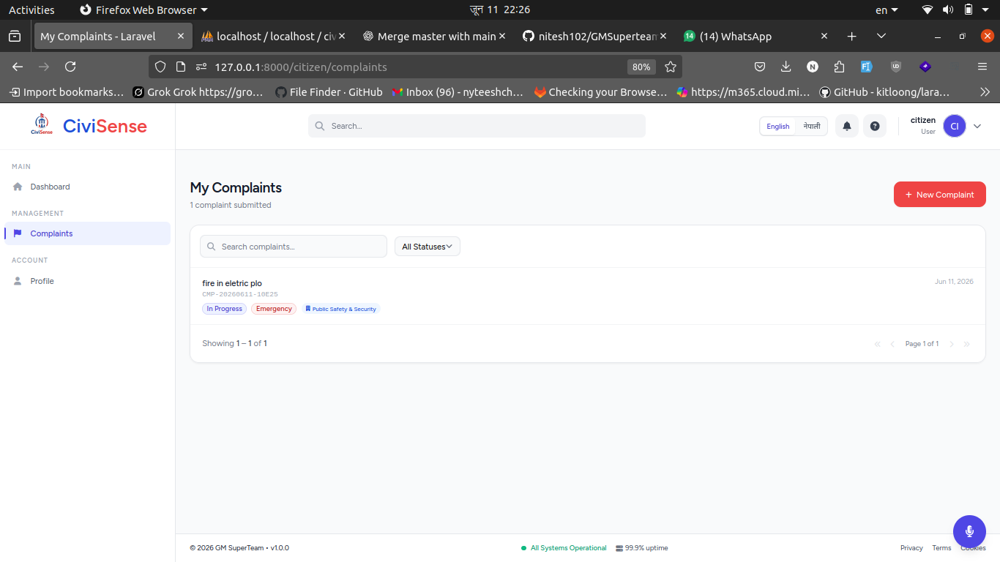
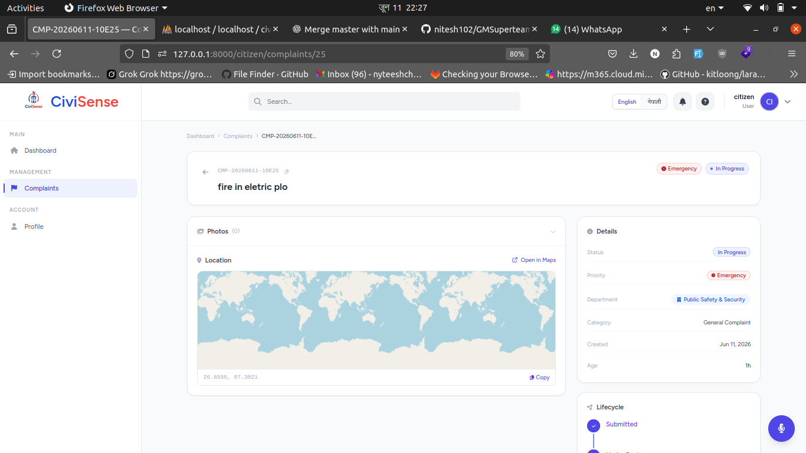
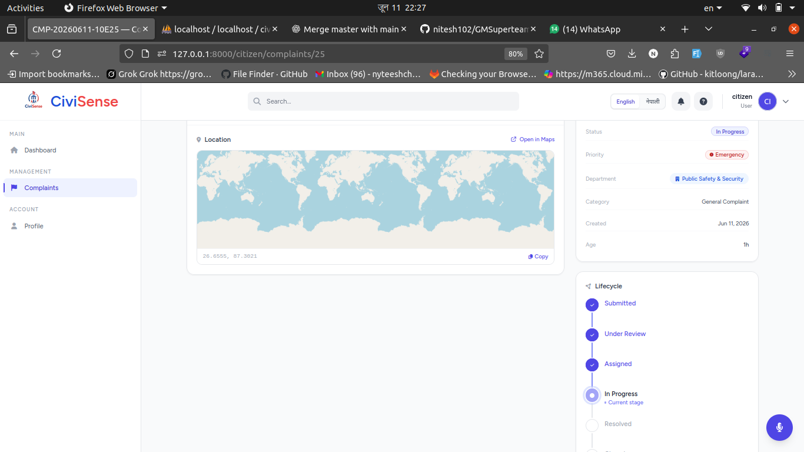
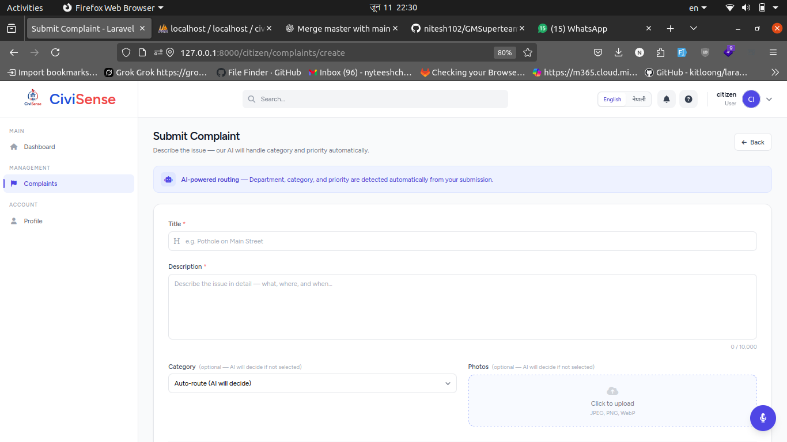

# CiviSense

**AI-First Civic Grievance Management System**

> Team: **GM Superteam** | IIC Quest 4.0

---

## Team Members

| Name | Role |
|------|------|
| Nitesh Chaudhary | Full Stack  |
| Subodh Dhungel | Backend / AI Integration |
| Deepak Khanal | Frontend  |
| Yunik Shrestha |  UI |

---

## Problem Statement

Civic grievances in Nepal disappear into a black hole:

- **Fragmented Channels** — Complaints scattered across calls, social media, offices; no unified platform.
- **Manual Triage Waste** — Staff spend hours manually sorting complaints, causing delays and burnout.
- **Language Barriers** — English-only platforms exclude Nepali-speaking citizens from civic governance.
- **Zero Transparency** — Citizens get no tracking, no status updates, no timeline.
- **No Accountability** — No escalation, no audits, no records of follow-through.
- **Accessibility Gap** — No voice input; elderly and less tech-savvy citizens are left behind.

---

## Solution

CiviSense is an **AI-first, voice-first** civic complaint platform that gives every citizen a real voice — literally.

| Pillar | What It Does |
|--------|-------------|
| **AI-First Triage** | Gemini 2.0 Flash auto-classifies complaints by department, priority, and category the moment they are submitted — no manual sorting |
| **Voice-First Access** | Citizens can navigate, file complaints, and search entirely by voice in English or Nepali (Web Speech API + Gemini 2.5 Flash NLU) |
| **Dual-Engine Voice** | Local bilingual regex patterns handle common commands instantly; Gemini handles ambiguous or complex utterances as fallback |
| **SLA Escalation** | Priority-based deadlines are auto-set; overdue complaints escalate automatically and are flagged on the dashboard |
| **Full Audit Trail** | Every status transition, assignment, and AI decision is timestamped and stored with role-based access control |
| **Optimistic UI** | Instant UI feedback on all actions; Inertia.js SPA transitions with no full-page reloads |

---

## Tech Stack

### Backend
| Technology | Purpose |
|-----------|---------|
| PHP 8.2 | Server-side language |
| Laravel 12 | Web framework (routing, ORM, queue, auth) |
| Inertia.js (Laravel adapter) | SPA bridge between Laravel and Vue |
| Laravel Sanctum | API authentication |
| Spatie Laravel Permission | Role-based access control (RBAC) |
| SQLite (default) / MySQL | Database |
| Laravel Queue | Background jobs (AI analysis dispatch) |

### Frontend
| Technology | Purpose |
|-----------|---------|
| Vue 3 | Reactive UI framework |
| Inertia.js (Vue 3 adapter) | Client-side SPA routing |
| Tailwind CSS 3 | Utility-first styling |
| Chart.js + vue-chartjs | Dashboard analytics charts |
| Leaflet + leaflet.markercluster | Interactive complaint map |
| vue-i18n | Bilingual English / Nepali i18n |
| Heroicons Vue | Icon set |
| Vite 7 | Frontend build tool |
| Axios | HTTP client |

### AI / APIs
| Integration | Model / Version | Purpose |
|------------|----------------|---------|
| Google Gemini (PHP — `google-gemini-php/laravel`) | `gemini-2.0-flash` | Backend complaint analysis: spam detection, department routing, priority, summary |
| Google Gemini (JS — `@google/generative-ai`) | `gemini-2.5-flash` | Voice command NLU fallback when local regex doesn't match |
| Web Speech API (browser-native) | — | Microphone speech-to-text transcription |

---

## Setup & Installation

### Prerequisites
- PHP >= 8.2 with extensions: `pdo_sqlite`, `mbstring`, `openssl`, `tokenizer`, `xml`
- Composer
- Node.js >= 18 + npm
- A Google Gemini API key ([get one free at Google AI Studio](https://aistudio.google.com/app/apikey))

### 1. Clone the repository
```bash
git clone https://github.com/nitesh102/GMSuperteam_iicquest4.0.git
cd GMSuperteam_iicquest4.0
```

### 2. Install dependencies
```bash
composer install
npm install
```

### 3. Environment configuration
```bash
cp .env.example .env
php artisan key:generate
```

Open `.env` and set your Gemini key:
```env
GEMINI_API_KEY=your_gemini_api_key_here
VITE_GEMINI_API_KEY=your_gemini_api_key_here
```

### 4. Database setup
```bash
php artisan migrate --seed
```

> The default database is mysql (`database/database.mysql` is created automatically).

### 5. Storage link
```bash
php artisan storage:link
```

### 6. Run locally
```bash
composer run dev
```

This starts all services concurrently:
- `php artisan serve` → [http://localhost:8000](http://localhost:8000)
- `npm run dev` (Vite HMR)
- `php artisan queue:listen` (AI analysis jobs)
- `php artisan pail` (log viewer)

### Default credentials (after seeding)
| Role | Email | Password |
|------|-------|----------|
| Admin | admin@gmail.com | admin@123 |

---

## AI Tools Used

### Google Gemini API
The core AI engine for the entire platform.

- **Complaint AI Analysis** (`app/Services/ComplaintAiService.php`)
  Uses `gemini-2.0-flash` to detect spam, route to the correct department, assign priority (low / medium / high / emergency), generate a technical summary, and analyze attached images — all on complaint submission.

- **Voice Command NLU** (`app/Services/VoiceCommandService.php`)
  Uses `gemini-2.5-flash` to interpret free-form voice utterances in English and Nepali when the local regex engine cannot match the command.

- **Frontend AI Composable** (`resources/js/Composables/useGeminiAI.js`)
  Browser-side direct Gemini calls for real-time UI features using `gemini-2.0-flash`.

### OpenCode (AI Coding Assistant)
Used during development for:
- Documentation drafting and architectural decision support
- Complaint business logic design (SLA rules, escalation triggers, state machine)
- UI enhancement suggestions and component structure

---

## Key Features at a Glance

- File complaints with photo attachments and GPS location
- AI auto-routes and prioritizes every complaint at submission
- Voice interface: say "show my complaints", "file a new complaint about road damage", or speak in Nepali — the system understands
- Bilingual UI (English / Nepali) switchable mid-session or by voice
- Real-time dashboard: complaint heatmap, status breakdown charts, SLA breach indicators
- Staff assignment with department-based RBAC
- Automatic SLA deadline enforcement and escalation
- Full audit trail on every complaint record

---

## Screenshots

### Admin Dashboard


### Admin Complaints


### Admin Complaint Detail


### Citizen Complaint Index


### Citizen Complaint Detail 1


### Citizen Complaint Detail 2


### Create Complaint


---

## License

MIT
